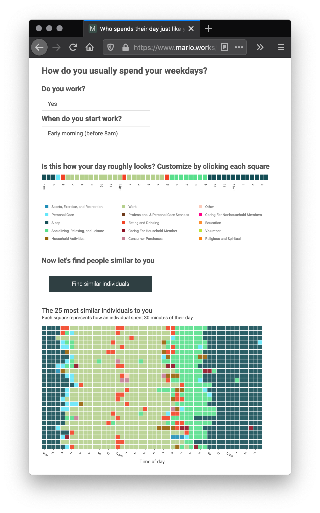
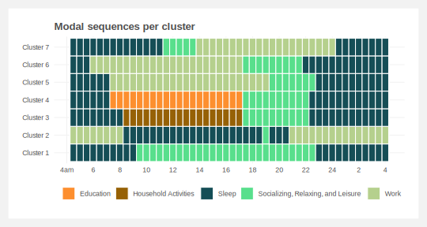

# Who spends their day similar to you?

[Tool](https://www.marlo.works/posts/atus-similar-days/) to visualize who spends their day most similar to you. Sequence analysis conducted in R. UI built in d3.js.

See also: [ATUS repo](https://github.com/joemarlo/ATUS)

## The tool

## Analysis

